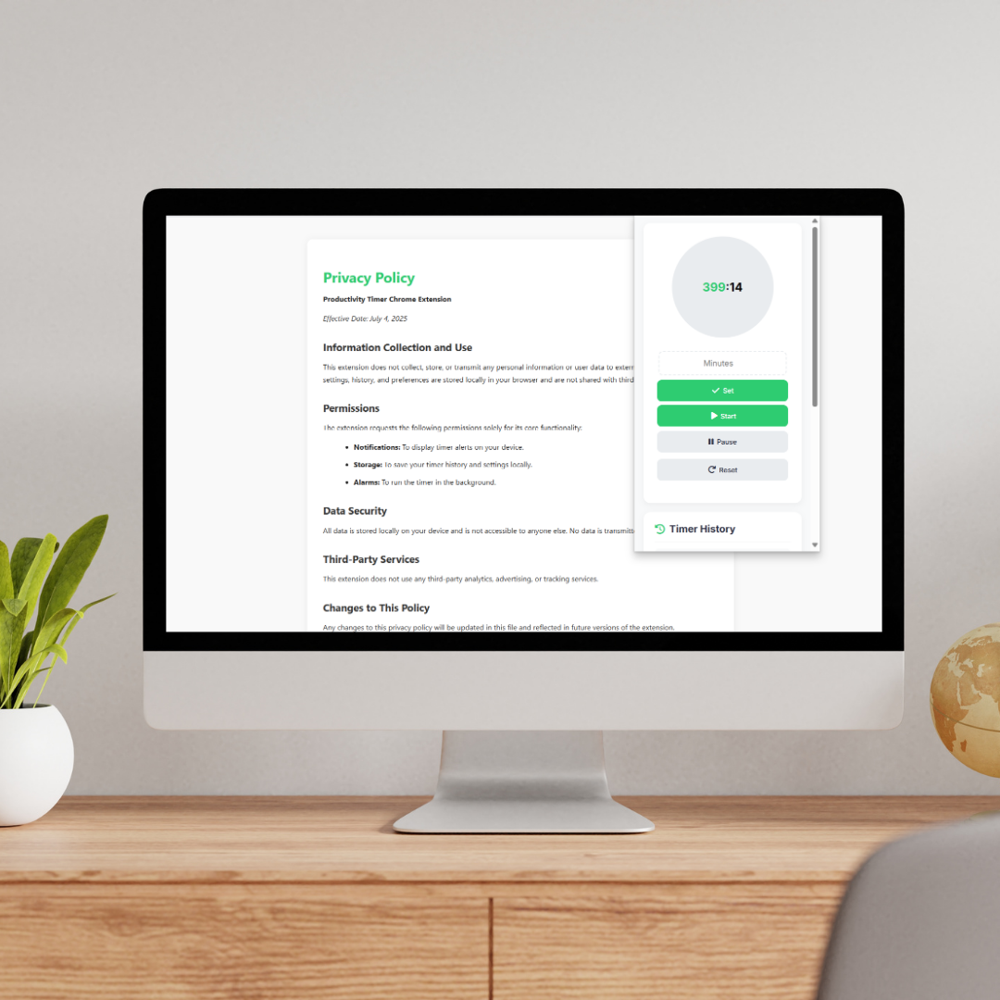

# Productivity Timer Chrome Extension

## Overview
Productivity Timer is a simple and effective Chrome extension designed to help you stay focused and manage your time efficiently. It features a customizable timer, persistent background notifications, a custom alert sound, and a history of your completed sessions.

## Features
- Customizable timer duration
- Start, pause, resume, and reset timer controls
- Persistent timer: continues running and notifies you even if the popup is closed or browser is restarted
- Desktop notifications and in-app toast messages for all timer actions (start, pause, resume, reset, and when the timer ends)
- **Custom notification sound** when the timer ends, in addition to the desktop notification
- Pause button toggles to "Resume" for clear user feedback
- Timer history (last 10 sessions)
- Clean and modern user interface

## Installation
1. Visit Chrome Web Store.
2. Search for (Productivity Timer ⏲)
---
3. You will find this --------  .png)
---
4. Click it and `Add to Chrome` it to your chrome extension. 
5. The Productivity Timer icon will appear in your Chrome toolbar.
6. Enjoy the Persistent Productive Timer that helps you achieve your goal without burning out time anymore

## Usage
1. Click the Productivity Timer icon in your Chrome toolbar to open the popup.
2. Set your desired timer duration or use the default 25 minutes.
3. Use the Start, Pause, Resume, and Reset buttons to control the timer. You will see toast notifications for every action.
4. When the timer ends, you will receive a desktop notification and hear a custom alert sound, even if the popup is closed or the browser is minimized.
5. Your timer session will be added to your history.

## File Structure
- `manifest.json` - Extension manifest file
- `popup.html` - Main popup UI
- `popup.js` - Timer logic, UI, and communication with background
- `background.js` - Persistent timer and notification logic (runs even when popup is closed)
- `popup.css` - Styles for the popup
- `notification.mp3` - Custom notification sound played when timer ends
- `icons/` - Extension icons (16x16, 48x48, 128x128)
- `LICENSE` - MIT License
- `README.md` - Project documentation

## Permissions
- `notifications` - To show desktop notifications when the timer ends
- `storage` - To save timer history and timer state
- `alarms` - To run the timer in the background

## Screenshots

---

---

## License
This project is licensed under the MIT License.

---

  <a href="PRIVACY.html" target="_blank" style="color: #007bff; text-decoration: none;">Privacy Policy</a>

